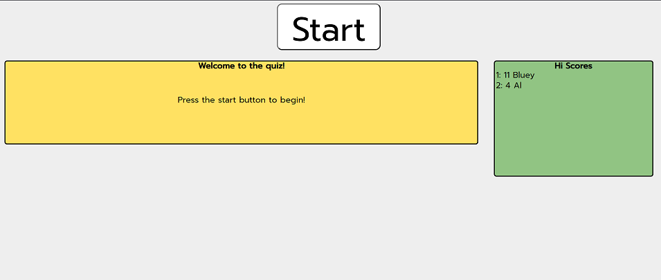
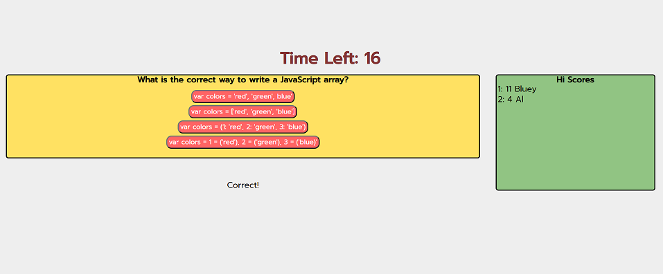
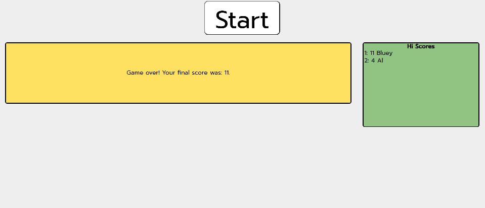

This is a simple javascript quiz game. 
You are presented with questions in a random order and randomly distributed multiple choice options.
On a correct answer you get one point, on an incorrect you get 0 points and 5 seconds are deducted from the time remaining.
When the time runs out you are asked for your name and your name and score are saved to memory. The top 10 scores are displayed on the page.

Page seen upon loading

Page seen while playing the game

Page seen after game has finished
